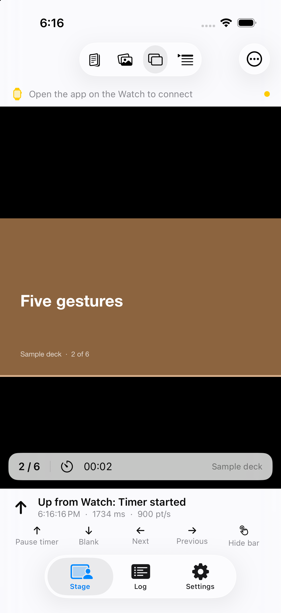
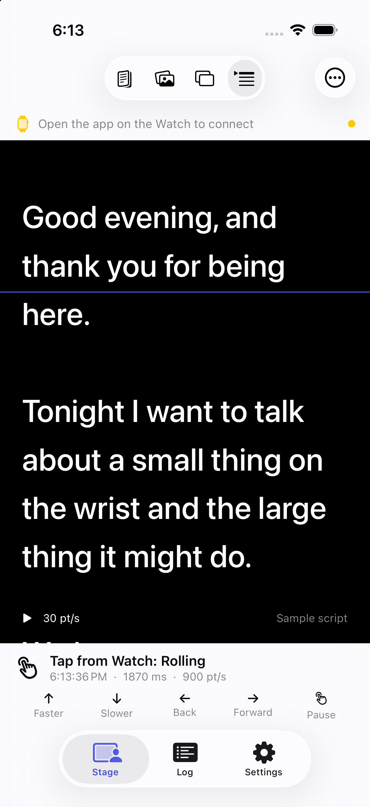
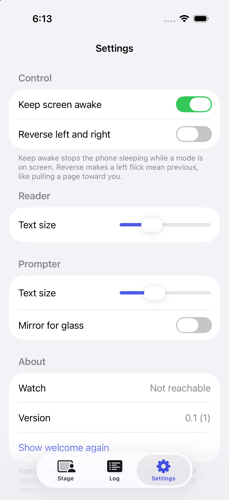

# Progress

A dated record of what the project looked like at each step, so the shape of
the interface can be seen changing. One folder per session under
`docs/progress/`. Newest first.

## 2026-09-18, later: four modes and a self-describing pad

The card deck is gone. The phone now has four things the Watch can drive,
and the pad labels its edges with what each direction does in the current
mode. The crown scrolls, Double Tap selects, a long press switches mode.
Around it: a welcome sheet, settings, keep-awake, imports that persist, a
privacy manifest, VoiceOver actions and 13 unit tests.

| | |
| --- | --- |
|  | The pad in Reader, Photos, Slides and Prompter. Same five gestures, different meanings, always written on the screen. |
|  | Reader, after two down flicks and a left: scrolled, then jumped to the next section of the sample recipe. |
|  | Photos, after a left and an up: second sample photo, starred. |
|  | Slides, after two lefts and an up: slide three of the sample deck, timer running. |
|  | Prompter, after a tap: the script rolling past the reading line. |
|  | The welcome sheet, with a live check that the Watch app is installed. |
|  | Settings. |

Learned today: `simctl launch` leaves the Watch simulator on its clock face
more and more often as a session goes on, and a reboot of the Watch
simulator resets that. Preferences cannot be cleared from outside the app
because the system caches them, hence the `-flickReset` launch argument.

## 2026-09-18: first link

The Watch pad and the phone deck exist and talk to each other on a paired
simulator pair. Six scripted flicks from the Watch (left, left, up, tap, right,
down) landed on the phone in order and left the deck in the expected state:
a starred second card of seven, with the dismissed card recoverable from the
menu.

What the interface is at this point: a bare pad on the Watch with the current
card's name, its position, a connection dot and a send counter; a single card
on the phone with a last-flick readout and a legend; and a log tab.

| | |
| --- | --- |
|  | Watch pad, connected, showing the phone's first card. |
|  | The flash that follows a left flick. Count at the bottom right. |
|  | After the phone answered: the current card is now starred. |
|  | Phone deck before any flick. |
|  | Phone deck after the six-flick script. |
|  | The log, with per-flick latency. Simulator numbers, not hardware. |
|  | The icon, drawn by `scripts/make-icon.swift`. |

Measured on the simulator: one to two seconds one way, about three seconds
round trip. Hardware numbers are the next thing to record here.

Found and worked around today: `simctl launch` does not forward arguments to
watchOS apps, the system relaunches a terminated Watch app within a second,
and the Watch simulator returns to its clock face after 15 idle seconds.
