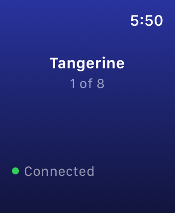
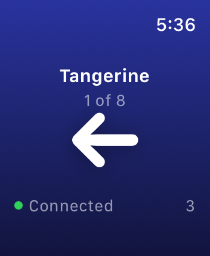
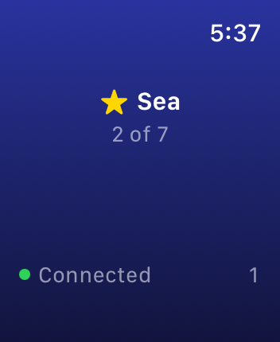
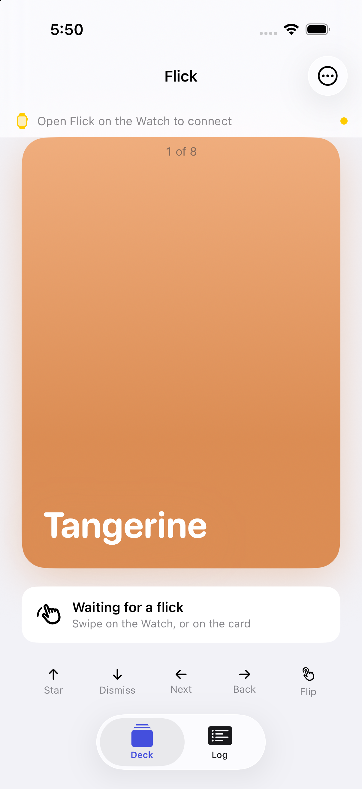
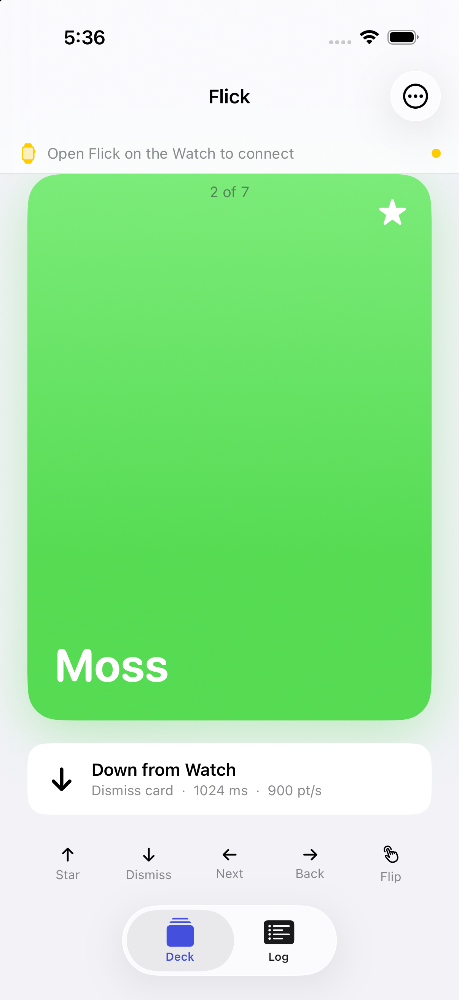
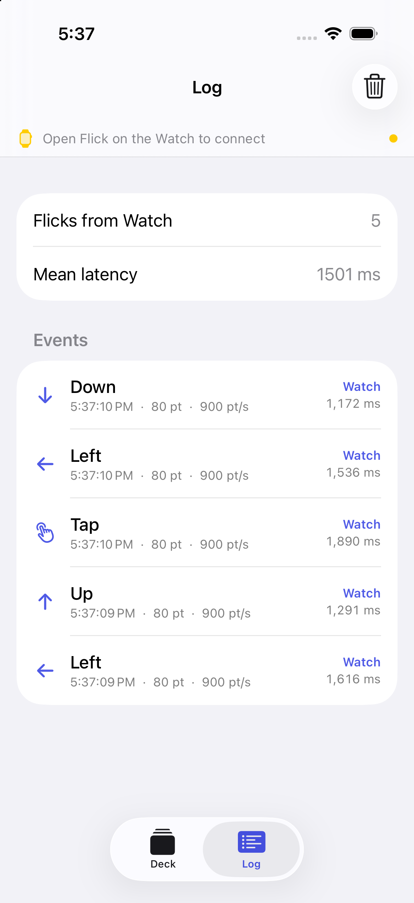

# Progress

A dated record of what the project looked like at each step, so the shape of
the interface can be seen changing. One folder per session under
`docs/progress/`. Newest first.

## 2026-09-18: first link

The Watch pad and the phone deck exist and talk to each other on a paired
simulator pair. Six scripted flicks from the Watch (left, left, up, tap, right,
down) landed on the phone in order and left the deck in the expected state:
a starred second card of seven, with the dismissed card recoverable from the
menu.

What the interface is at this point: a bare pad on the Watch with the current
card's name, its position, a connection dot and a send counter; a single card
on the phone with a last-flick readout and a legend; and a log tab.

| | |
| --- | --- |
|  | Watch pad, connected, showing the phone's first card. |
|  | The flash that follows a left flick. Count at the bottom right. |
|  | After the phone answered: the current card is now starred. |
|  | Phone deck before any flick. |
|  | Phone deck after the six-flick script. |
|  | The log, with per-flick latency. Simulator numbers, not hardware. |
|  | The icon, drawn by `scripts/make-icon.swift`. |

Measured on the simulator: one to two seconds one way, about three seconds
round trip. Hardware numbers are the next thing to record here.

Found and worked around today: `simctl launch` does not forward arguments to
watchOS apps, the system relaunches a terminated Watch app within a second,
and the Watch simulator returns to its clock face after 15 idle seconds.
