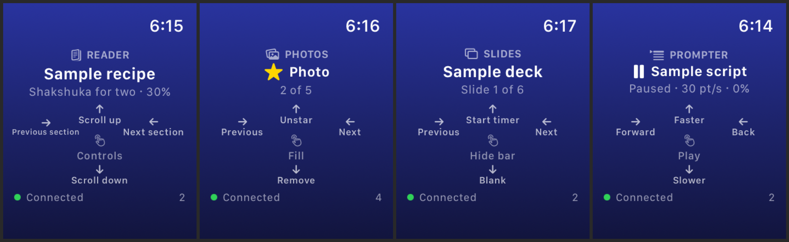
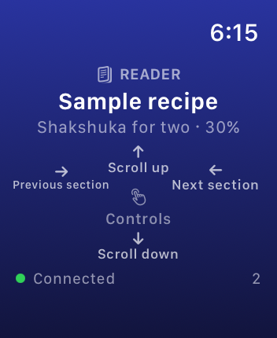
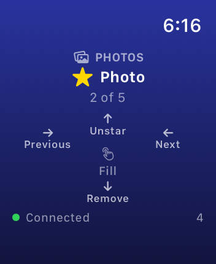
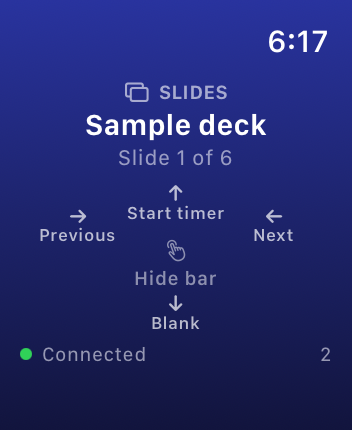
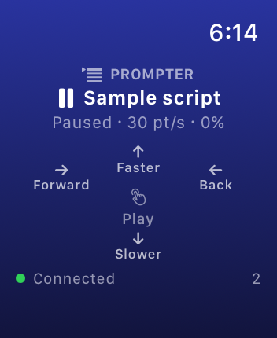
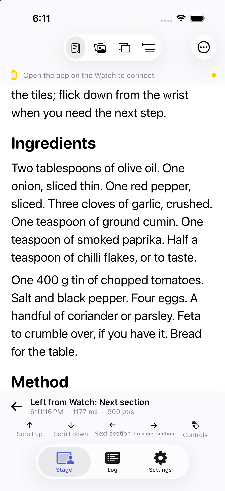
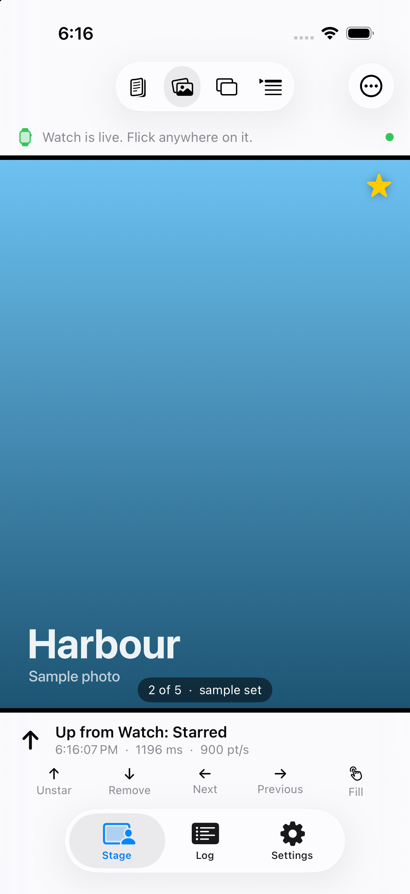
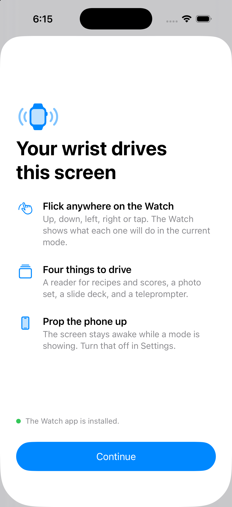

<div align="center">

# watchOS Swipe Surface

**The Apple Watch as a touch surface for other Apple devices. iPhone first, Apple TV and Apple Vision Pro next.**



</div>

---

## Abstract

The Apple Watch is sold as a health tracker that happens to have a screen. This
project treats it as the opposite: a very small touch surface that happens to be
worn. Take away the strap and the sensors, and what remains is a palm-sized
puck with a bright touchscreen, a haptic engine and a radio link to every other
Apple device its owner carries. The question is what that puck is good for as an
input device for those other screens.

The first target is the iPhone. A watchOS app turns the whole Watch display
into a gesture pad. Five gestures, up, down, left, right and tap, cross to the
phone over WatchConnectivity as a small timestamped event, the phone acts on
them, and answers with what it is now showing so the pad can name the thing its
next flick will move. Every flick is logged on the phone with its direction,
speed and one-way latency, so the link itself can be measured.

Apple ships this gesture grammar for the Apple TV Remote and for Keynote, and
relays Watch gestures to the iPhone only inside the VoiceOver accessibility
path. There is no general-purpose Watch swipe surface for the phone, and no
public API that would let a third party build one outside its own app. That gap
is the starting point.

## What is built

The phone app has four modes. Each one owns its content and decides what the
five gestures and the crown mean while it is showing. The Watch pad labels
its edges with the current mode's meanings, so a flick always says what it
will do before it is made.

| Mode | What it is for | Left / right | Up / down | Tap |
| --- | --- | --- | --- | --- |
| **Reader** | Recipes, scores, manuals. Text or PDF, propped up, hands busy. | Next / previous section or page | Scroll by most of a screen | Show or hide the text-size controls |
| **Photos** | A set of photos and videos, phone across the table. | Next / previous | Star / remove | Play or pause a video, fit or fill a photo |
| **Slides** | A PDF deck or images, on the phone or a mirrored display. | Next / previous | Start or pause the timer / blank the screen | Hide or show the presenter bar |
| **Prompter** | A script rolling past a reading line, for speaking or filming. | Jump back / forward | Faster / slower | Play or pause |

On the Watch:

- **The whole screen is the pad.** Drags are classified by dominant axis;
  diagonals and brushes are ignored and a short fast flick counts on its
  predicted travel. Each direction has its own haptic.
- **The Digital Crown scrolls** the reader, steps slides, scrubs video, and
  nudges the prompter. Turns are summed and sent at most every 80 ms.
- **Double Tap selects.** On Series 9 and later with watchOS 11, the pinch
  gesture triggers the tap action, so a flick and a select never need the
  other hand.
- **Long press picks the mode** and holds the one Watch setting, haptics.
- **Nothing lost.** Flicks and mode changes made while the phone is out of
  reach are queued and delivered on the next connection.

On the phone:

- **Import from Files or the photo library**, or paste text. Imports are
  copied into the app so a deck or a set is still there tomorrow. Every mode
  ships with sample content so it does something on first launch.
- **The screen stays awake** while a mode is showing, because a propped-up
  phone must not sleep mid-recipe. Off in Settings.
- **Reverse left and right** for people who think of a left flick as pulling
  the previous page toward them. The Watch legend follows.
- **A log** of every flick that landed, with its mode, what it did, its
  speed, and how long it took to arrive.
- **A test pad** under the stage: swiping there goes through the same
  pipeline, so the phone can be developed without a Watch.
- **Welcome sheet** with a live check that the Watch app is installed,
  VoiceOver actions for every gesture, a privacy manifest, and unit tests for
  the classifier, the wire format and the four models.

## Screenshots

Simulator, 18 September 2026. Latency in the simulator is one to two seconds
per hop and is not representative of hardware.

| Reader | Photos | Slides | Prompter |
| --- | --- | --- | --- |
|  |  |  |  |
|  |  |  |  |

| Welcome | Settings |
| --- | --- |
|  |  |

The dated history of what the project looked like at each step is in
[PROGRESS.md](PROGRESS.md).

## Prior art

The idea is established in pieces. What is missing is the general case.

**Apple's own features.** The [Remote app for Apple TV](https://support.apple.com/guide/watch/remote-apd619078d99/watchos)
uses the Watch screen as a touch surface: swipe to move, tap to select, crown
for volume. [Keynote](https://support.apple.com/en-us/102016) advances slides
from a tap or swipe on the Watch, and from the Double Tap hand gesture on
Series 9 and later. [Control Nearby Devices](https://support.apple.com/guide/watch/control-nearby-devices-apdbf0e78757/watchos),
under Accessibility, offers Home, App Switcher, Notification Center, Control
Center, Siri and media buttons for the paired iPhone, and with VoiceOver on,
gestures made on the Watch are performed on the phone. The reverse direction,
[Apple Watch Mirroring](https://support.apple.com/guide/watch/applewatch-mirroring-apd890848603/watchos),
lets the phone control the Watch. Camera Remote and Now Playing are one-purpose
remotes.

**What Apple does not do.** There is no system-level relay of touch from a
third-party Watch app to the iPhone. WatchConnectivity only speaks to the app's
own companion. Community threads confirm there is no native way to scroll the
phone from the wrist ([Apple Community](https://discussions.apple.com/thread/253295458)).

**Third-party precedent** is app-scoped, as this project is. A teleprompter
app relays Watch buttons and gestures to its own iPhone prompter
([PrompterPal Watch Remote](http://www.sunshinevalleysystems.com/Teleprompter/PrompterPal/Support/WatchRemote.html)).

**Research.** *Duet* (Chen, Grossman, Wigdor, Fitzmaurice, CHI 2014) explored a
design space of joint phone and watch interactions, including the watch as an
input surface and gesture source for phone tasks
([ACM](https://dl.acm.org/doi/10.1145/2556288.2556955),
[PDF](https://www.research.autodesk.com/app/uploads/2023/03/duet-exploring-joint-interactions.pdf_rec8qaQcQAoqcCIW0.pdf),
[patent application](https://patents.google.com/patent/US20150153928), assigned
to Autodesk). *WatchConnect* (Houben and Marquardt, CHI 2015) is a toolkit for
prototyping watch-centric cross-device applications
([PDF](https://stevenhouben.be/pubs/WatchConnectCHI2015.pdf)). Later work
includes context-aware phone and watch cross-device interfaces
([IMWUT 2017](https://dl.acm.org/doi/10.1145/3130934)) and a cross-device task
framework ([Personal and Ubiquitous Computing 2019](https://link.springer.com/article/10.1007/s00779-019-01280-7)).

**Apple patents** in this area concern hand gestures sensed at the wrist rather
than touch: the 2014 wristband patent describing the band as a remote input
surface for a phone ([AppleInsider](https://appleinsider.com/articles/14/07/22/apple-granted-comprehensive-itime-smartwatch-patent-with-in-strap-circuitry-arm-gesture-support)),
and optical gesture sensing that shipped as Double Tap and Wrist Flick
([Wareable](https://www.wareable.com/apple/future-apple-watch-gesture-controls)).

## Research direction

The thesis is that the Watch is a good handheld controller for screens that are
not in the hand: a phone propped on a desk or across a room, a television, and
a headset that has no touch surface at all. The plan is to keep the gesture pad
and the event model fixed and change the target.

One constraint shapes everything. No third-party app can move the system
interface of an iPhone, an Apple TV or a Vision Pro; Apple reserves that for
its own accessibility features. What an app can do is bring its own interface
to each device and let the Watch drive that. So the product is one app whose
shell runs on every target, controlled from the wrist.

1. **iPhone** (done in prototype). Measures the link and the gesture vocabulary.
2. **Apple TV.** Apple already ships a Watch remote for it, so the question is
   what a per-app remote adds over the system one: gestures tied to the content
   on screen, and a pad that names what it is pointing at.
3. **Apple Vision Pro.** The most open target. The Watch does not pair with
   Vision Pro and WatchConnectivity exists only on iOS and watchOS, so the link
   has to be either the iPhone acting as a bridge, or a direct local network
   path from the Watch using the Network framework. Which of those is fast
   enough is itself a finding.

Open questions the prototype is built to answer:

- Round-trip latency of WatchConnectivity on hardware, and whether it is stable
  enough for continuous control rather than discrete commands.
- Whether five gestures are enough, and whether the crown earns a place.
- How the pad should behave when the phone is unreachable: queue, drop, or
  refuse.
- Whether a person will reach for the wrist when the phone is a metre away.

## Layout

```
Flick/                 iPhone app (the prototype's code name is Flick)
  App/                 entry, root tabs, welcome, Watch status bar, debug routing
  Core/                PhoneLink (WCSession), SwipeHub, AppSettings, DocumentStore
  Features/Stage       mode switcher, the readout and test pad
  Features/Reader      text and PDF reader
  Features/Photos      photo and video set
  Features/Slides      PDF or image deck with timer and blanking
  Features/Prompter    rolling script
  Features/Log         the event log
  Features/Settings
  Samples/             bundled recipe, script and slide deck
Flick Watch App/       watchOS app: WatchLink, GesturePadView, ModeSheet
FlickTests/            classifier, wire format and model tests
Shared/                SwipeEvent, Mode, PhoneContext, WatchMessage, SwipeClassifier, Wire
docs/screenshots/      current state of the interface
docs/progress/         dated captures, one folder per session
scripts/               make-icon.swift, make-samples.swift, run-sim.sh
```

## Build and run

Open `Flick.xcodeproj` in Xcode 26 or later, pick the `Flick` scheme and a
paired iPhone and Watch. Running the iPhone scheme also installs the Watch
app on the paired Watch.

From the terminal, on a paired simulator pair:

```bash
scripts/run-sim.sh
```

Targets iOS 18 and watchOS 11. Swift 6 language mode.

### Simulator notes

`simctl` cannot touch a Watch, so debug builds accept a scripted mode and
flicks:

```bash
SIMCTL_CHILD_FLICK_MODE=slides SIMCTL_CHILD_FLICK_SEND=left,left,up xcrun simctl launch --terminate-running-process <watch-udid> com.rabiats.flick.watchkitapp
```

They fire in order as soon as the phone is reachable. Two things to know:

- The Watch simulator goes back to its clock face 15 seconds after the last
  touch, and scripted input does not count, so a script has a few seconds
  to run once the app is up. A real Watch under a finger never does this.
- After `simctl terminate`, the system relaunches the Watch app in the
  background within a second to deliver pending session content, so a
  plain `simctl launch` attaches to that process without your environment.
  Always pass `--terminate-running-process`.

The phone accepts `-flickMode reader|photos|slides|prompter`, `-flickTab
stage|log|settings`, and `-flickReset`, which wipes the app's defaults and
imports for a first-run capture. Tests run with `xcodebuild test` on the
`Flick` scheme.

## How the link works

`WCSession` calls its delegate on a private queue. Both `PhoneLink` and
`WatchLink` are main-actor classes whose delegate methods are `nonisolated`.
Each one reads what it needs from the session, converts it to plain Sendable
values, and hops to the main actor. The reply block the SDK hands the phone
is not marked Sendable, so it is carried across with `nonisolated(unsafe)`
and called exactly once.

The phone publishes its state as application context after every change.
Application context is "latest wins" and survives the Watch app closing, so
the pad always knows what the next flick will act on when it reopens.

See [ARCHITECTURE.md](ARCHITECTURE.md) for the data flow.
